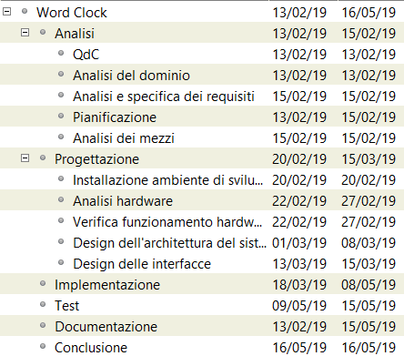

# Word Clock | Diario di lavoro - 15.02.2019
##### Gabriele Alessi, Mattia Lazzaroni, Paolo Weishaupt
### Canobbio, 15.02.2019

## Lavori svolti
Durante questa giornata abbiamo concluso l'analisi del progetto come pianificato.  
Gabriele ha finito il Gantt preventivo e il capitolo 1.5 della documentazione (Analisi dei requisiti).  
Mattia ha fatto il capitolo 1.7 (Analisi dei mezzi), si è informato sul funzionamento delle strisce NeoPixel e ha preso le misure della matrice per sapere la corrente necessaria.  
Paolo si è informato su come impostare il Fishino e su come collegarsi tramite Wifi.  
Il seguente è un esempio di requisito:

|ID  |REQ-002                                         |
|----|------------------------------------------------|
|**Nome**    |Implementare il Word Clock |
|**Priorità**|1                     |
|**Versione**|1.0                   |
|**Note**    |È necessario implementare il Word Clock in modo che mostri l’orario sotto forma di linguaggio parlato.|
|            |**Sotto requisiti** |
|**001**      | Scrivere il testo con le differenze di 5 minuti  |
|**002**      | Mostrare i secondi tramite l’utilizzo di 12 LED, quindi 5 secondi per ogni pallino acceso.               |
|**003**      | Si dovrà poter controllare e impostare l’orario e le impostazione tramite il modello fisico.         |
|**004**| Cambiare i colori dei LED in base all’orario. |

Questa è la pianificazione effettuata: 

| Orario | Lavori svolti |
| - | - |
|13:15 - 16:30 | Analisi |

##  Problemi riscontrati e soluzioni adottate
Nessun problema riscontrato.
##  Punto della situazione rispetto alla pianificazione
In linea con la pianificazione.
## Programma di massima per la prossima giornata di lavoro
Inizio progettazione.