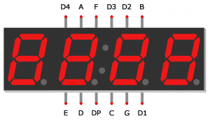

# Word Clock | Diario di lavoro - 03.05.2019
##### Gabriele Alessi, Mattia Lazzaroni, Paolo Weishaupt
### Canobbio, 03.05.2019

## Lavori svolti
Durante questa giornata abbiamo lavorato sull'implementazione del word clock.  
Siamo prossimi nel fare i test (almeno su quello che funziona) e quindi fare una revisione generale.
Paolo e Mattia hanno lavorato su ciò, nel frattempo Gabriele ha continuato con l'implementazione dei pulsanti fisici.
```arduino
int pinA = 2;
int pinB = 3;
int pinC = 4;
int pinD = 5;
int pinE = 6;
int pinF = 7;
int pinG = 8;
int D1 = 9;
int D2 = 10;
int D3 = 11;
int D4 = 12;

void setup() {
  pinMode(pinA, OUTPUT);
  pinMode(pinB, OUTPUT);
  pinMode(pinC, OUTPUT);
  pinMode(pinD, OUTPUT);
  pinMode(pinE, OUTPUT);
  pinMode(pinF, OUTPUT);
  pinMode(pinG, OUTPUT);
  pinMode(D1, OUTPUT);
  pinMode(D2, OUTPUT);
  pinMode(D3, OUTPUT);
  pinMode(D4, OUTPUT);
  digitalWrite(D1, HIGH);
  digitalWrite(D2, HIGH);
  digitalWrite(D3, HIGH);
  digitalWrite(D4, HIGH);
}

void loop() {
  digitalWrite(D1, LOW);
  digitalWrite(pinA, HIGH);
  digitalWrite(pinB, HIGH);
  digitalWrite(pinC, LOW);
  digitalWrite(pinD, LOW);
  digitalWrite(pinE, HIGH);
  digitalWrite(pinF, HIGH);
  digitalWrite(pinG, HIGH);
}
```


https://create.arduino.cc/projecthub/SAnwandter1/programming-4-digit-7-segment-led-display-2d33f8  
http://www.circuitbasics.com/arduino-7-segment-display-tutorial/  
Grazie a questi elementi siamo riusciti a capire il funzionamento dei 4 display 7 segmenti, quindi durante la prossima occasione si potrebbe pensare di concludere ciò aggiungendo i pulsanti cambiando l'orario.

| Orario | Lavori svolti |
| - | - |
|13:15 - 16:30 | Implementazione |

##  Problemi riscontrati e soluzioni adottate
Il Fishino purtroppo da ancora problemi in quanto non funziona quando si collega al pc per caricare un programma e non identifica il dispositivo (timeout).
##  Punto della situazione rispetto alla pianificazione
È necessario proseguire con il resto del progetto (documentazione), comunque non dovremmo essere in ritardo nel complessivo.
## Programma di massima per la prossima giornata di lavoro
Correzione problemi word clock, documentazione e revisione dei codici sorgente. Implementazione pulsanti fisici.